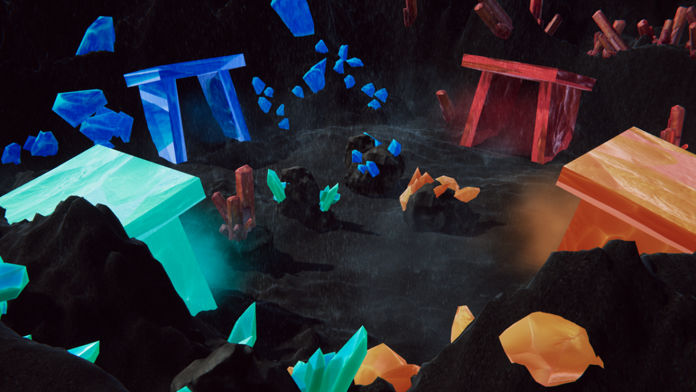
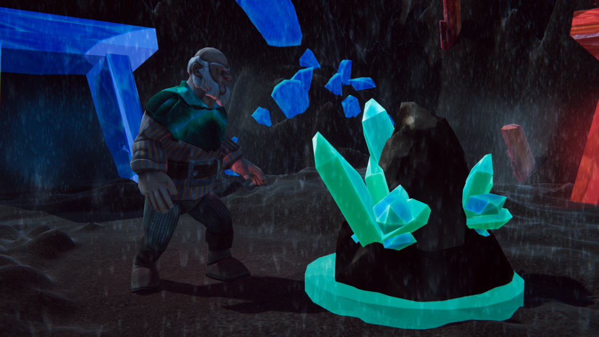

# CRYSTAL RAIN
Gamagora 2019 - Vision par Ordinateur - Flow

## Participants au projet : 
***Antoine CHEDIN & Rendy LATBI***

## Illustrations  : 

## Fiche signalétique :
*Crystal Rain est un jeu de gestion. En vue troisième personne, le joueur contrôle un groupe de mineurs et doit collecter un maximum de minerais. Des wagons explosifs apparaissent au cours de la partie et ce dernier doit faire en sorte de ne perdre aucun mineur en évitant tout contact avec ces wagons !*  
Le joueur controle un seul mineur au départ puis ce nombre augmente avec le temps (jusqu'à 4). 
Chaque mineur possède une couleur et peut seulement ramasser les minerais de sa couleur. 
Les minerais doivent être rapportés à la base de la couleur qui leur est associée. 
Si un mineur entre en contact avec un wagon, le joueur perd, et le jeu s'arrête. 
Le Score final est la somme des minerais stockés dans les bases des mineurs. 
Pour déplacer les mineurs, on place sur un plateau des marqueurs :
- **La caméra** filme le plateau et la position blabla 
- **La caméra** filme le plateau et la position conversion des coords
- **La caméra** filme le plateau et la position le mineur va vers la target
- **La caméra** filme le plateau et la position si y'a un minerai a portée il mine (file d'attente)

## Répartition des tâches :
- ***Antoine*** : Score/ComboManager, Interface, Inputs, Generation d'Obstacles Endless
- ***Rendy*** : Sons, Animations, Particules, Game Manager, Animation des Wagons, Post Processing
- *Wagons & Rails réalisés par MediaaEdit, IG : Mediaa.edits*
